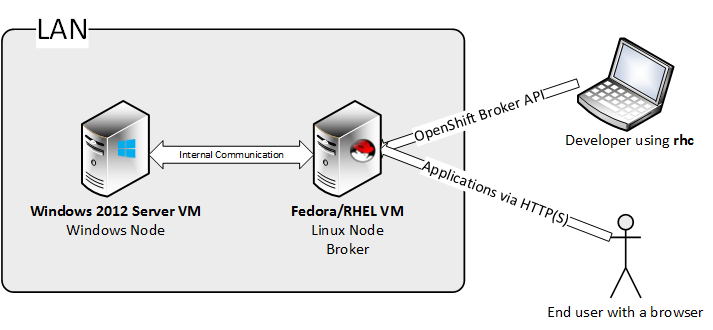
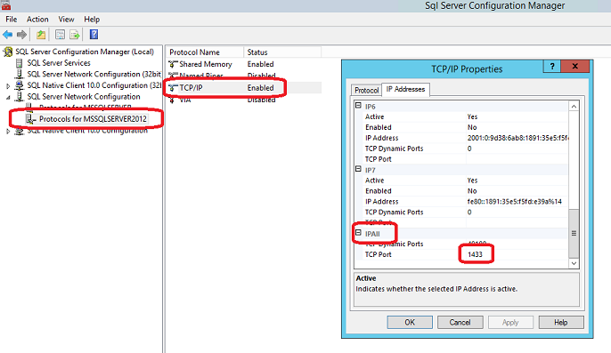
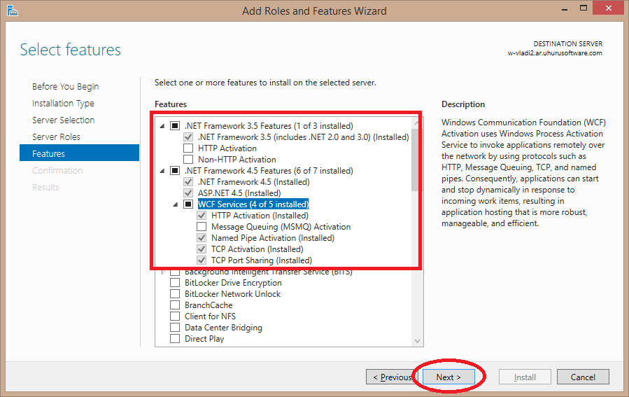

# Deploying OpenShift with Windows support #

[Summary](#summary)

[Cloud Topology](#cloud-topology)

[Linux](#linux)

- [Using the Fedora all-in-one VM](#using-the-fedora-all-in-one-vm)
- [Using an OpenShift Enterprise Installation](#using-an-openshift-enterprise-installation) 
- [Update OpenShift with changes required for Windows Support](#update-openshift-with-changes-required-for-windows-support)

[Windows Prerequisites](#windows-prerequisites)

- [Screenshots](#screenshots)

[Setting up DNS](#setting-up-dns)

- [Using the Fedora all-in-one VM](#using-the-fedora-all-in-one-vm)
- [Using an OpenShift Origin or Enterprise Installation](#using-an-openshift-origin-or-enterprise-installation)

[Installing the OpenShift Windows Node](#installing-the-openshift-windows-node)
- [Build the installer](#build-the-installer)
- [Install on the node](#install-on-the-node)
- [Restarting services on the broker](#restarting-services-on-the-broker)
- [Install Script Manual](#install-script-manual)
- [Using a proxy when installing the windows node](using-a-proxy-when-installing-the-windows-node)

[Creating your first Windows application](#creating-your-first-windows-application)

[Creating districts](#creating-districts)

[Diagnosing the Windows Node](#diagnosing-the-windows-node)

## Summary ##

This document provides instructions on how to deploy an OpenShift environment that has Windows support. 
There are two options:
- use an Origin Fedora VM that comes with a full installation - a broker and a node on the same VM (good for development environments)
- use an OpenShift Enterprise installation 

Next to either of these we're going to setup a Windows VM that will connect to the Linux OpenShift broker. 

## Cloud Topology ##

## Linux ##

Make sure your OpenShift deployment includes [this pull request](https://github.com/openshift/origin-server/pull/4944).  

## Windows Prerequisites ##

**Please make sure that you execute all the instructions in this document as the `administrator` user .**

The supported Windows versions are Windows Server 2012 and Windows Server 2012 R2.

- After installing Windows, activate the following features:
	- NET-Framework-Features
	- NET-Framework-Core
	- NET-Framework-45-Features
	- NET-Framework-45-Core
	- NET-Framework-45-ASPNET
	- NET-WCF-Services45
	- NET-WCF-TCP-PortSharing45

- Install the Visual C++ Redistributable Packages for Visual Studio 2013. You can find it [here](http://www.microsoft.com/en-us/download/details.aspx?id=40784). Make sure to download the 'vcredist_x64.exe' version.

- Install build tools for Visual Studio 2012 and 2013. Build tools for Visual Studio 2008 and 2010 are optional, the installer won't abort if they aren't found. **Please note that the 2008 version of the installer first sets up the 'real' installer in `C:\VS 2008 Shell Redist\Isolated Mode`. You will have to run the `vs_shell_isolated.enu` package from there to complete the installation**. Make sure to keep the filenames of the installers intact (use separate folders when downloading the packages); the installers are sensitive to their filenames being changed. You can find them at the following locations:
    - [Microsoft Visual Studio 2013 Shell (Isolated)](http://www.microsoft.com/en-us/download/details.aspx?id=40764)
    - [Microsoft Visual Studio 2012 Shell (Isolated)](http://www.microsoft.com/en-us/download/details.aspx?id=30670)
    - [Microsoft Visual Studio 2010 Shell (Isolated) - ENU](http://www.microsoft.com/en-us/download/details.aspx?id=1366)
    - [Microsoft Visual Studio Shell 2008 - ENU](http://www.microsoft.com/en-us/download/details.aspx?id=7036)

- Install Microsoft Agents for Visual Studio 2013. You can find it [here](http://www.microsoft.com/en-us/download/details.aspx?id=40750). This is not mandatory. It is needed if you want to run mstest during a jenkins build. Make sure to add the directory containing mstest.exe (C:\Program Files (x86)\Microsoft Visual Studio 12.0\Common7\IDE) to PATH environment variable.

- Install Internet Information Services
	- Add the Web Server role to Windows, with the following features enabled:

		Web-Server, Web-WebServer, Web-Common-Http, Web-Default-Doc, Web-Dir-Browsing, Web-Http-Errors, Web-Static-Content, Web-Http-Redirect, Web-DAV-Publishing, Web-Health, Web-Http-Logging, Web-Custom-Logging, Web-Log-Libraries, Web-ODBC-Logging, Web-Request-Monitor, Web-Http-Tracing, Web-Performance, Web-Stat-Compression, Web-Dyn-Compression, Web-Security, Web-Filtering, Web-Basic-Auth, Web-CertProvider, Web-Client-Auth, Web-Digest-Auth, Web-Cert-Auth, Web-IP-Security, Web-Url-Auth, Web-Windows-Auth, Web-App-Dev, Web-Net-Ext, Web-Net-Ext45, Web-AppInit, Web-Asp-Net, Web-Asp-Net45, Web-CGI, Web-ISAPI-Ext, Web-ISAPI-Filter, Web-Includes, Web-WebSockets, Web-Mgmt-Tools, Web-Scripting-Tools, Web-Mgmt-Service, Web-WHC

- Install SQL Server 2008
	- Install SQL Server with a simple default instance (no extra services, just the database engine)
    - Make sure you set it up with mixed authentication
    - Please note the password you set for the `sa` account - you will need to configure the OpenShift node with it
    - After the installation is complete, stop the `SQL Server (MSSQLSERVER)` Windows Service, then disable it (the Windows Node installation script will check to see if this was setup correctly)
	
- Install SQL Server 2012
	- Install SQL Server 2012 with a simple named instance MSSQLSERVER2012(no extra services, just the database engine)
    - Make sure you set it up with mixed authentication
    - The password you set for the `sa` account has to be the same as the one for SQL Server 2008
	- Enable TCP/IP SQL Server 2012 Protocol to listen to All IPs
    - After the installation is complete, stop the `SQL Server (MSSQLSERVER2012)` Windows Service, then disable it (the Windows Node installation script will check to see if this was setup correctly)
	- **IMPORTANT! Make sure that the TCP/IP protocol is enabled for SQL Server 2012 and that the port 1433 is set to for "IPAll" in the Sql Server Configuration Manager**
	

- Download and install Java JRE 7 x64 from here: http://www.oracle.com/technetwork/java/javase/downloads/jre7-downloads-1880261.html
	
 
- **MAKE SURE THE TIME OF THE VM IS SYNCED**

###Screenshots###

The screenshots below detail the installation steps for the Windows Roles and Features that have to be installed.
This walk-through assumes you are managing the server locally, not remotely. 

**Step 1 - Open Server Manager and start the "Add roles and features" wizard**

**Step 2 - Go to Server Selection** 

**Step 3 - In the server selection page, select the local server, then hit "Next"**

**
Step 4 - Make sure you select all the required roles and their features, as detailed in the documentation and screenshot, then click "Next"
**

**
Step 5 - On the features page, make sure you select everything as detailed in the documentation and screenshot
** 

**Step 6** - On the confirmation page, click "Install" and wait for the installation process to complete

## Setting up DNS ##

Before proceeding with the Windows installation, you have to make sure your hosts resolve ok.

###Using the Fedora all-in-one VM

You have to setup the hosts files on both Windows and Linux (the OpenShift VM uses multicast DNS and Windows does not have a proper solution for this).

- on Linux, edit `/etc/hosts`, add an entry like 

	e.g.: `10.2.0.104 winnode.openshift.local`

- on Windows, edit `c:\windows\system32\drivers\etc\hosts`, and add an entry for the broker:

	e.g.: `10.2.0.21 broker-a211bd.openshift.local`

###Using an OpenShift Origin or Enterprise Installation

On the Broker VM, use the following command to register the windows node on the local DNS server:

		oo-register-dns --with-node-hostname <the hostname of the windows node (not fqdn, e.g. winnode1)> \
		--with-node-ip <the public ip of the node> --domain <domain of the cloud, e.g. mycloud.com> \
		--dns-server <the hostname of the broker (e.g. broker.mycloud.com)>

Setup a conditional forwarder for your cloud's domain in your organization's DNS server

The Windows Node will have to use your organization's DNS server.

To make sure everything is in order, see if these return the proper response:
- On Windows, `nslookup <broker_fqdn_hostname>`
- On Linux, `nslookup <windows_node_fqdn_hostname>`

## Installing the OpenShift Windows Node ##

### Build the installer ###

1. Make sure you have Visual Studio 2013 installed 
2. Clone the [openshift.net](https://github.com/UhuruSoftware/openshift.net) repo

		git clone git@github.com:UhuruSoftware/openshift.net.git 

3. Open a Visual Studio 2013 x64 Native tools command prompt, usually located at:
		
		"%ProgramFiles(x86)%\Microsoft Visual Studio 12.0\Common7\Tools\Shortcuts\VS2013 x64 Native Tools Command Prompt"

4. Change directory to your openshift.net clone
5. Run the following commands:

		build
		powershell -file package.ps1 package
6. Done. You should have an installer `uhuru-openshift-winnode.exe` in your openshift.net clone dir.

### Install on the node ###

- Disable powershell execution policy: `Set-ExecutionPolicy Unrestricted`
- Run the installer
- It will unpack the build in a temporary folder and drop you in PowerShell
- From there you can run the installation script:
  - For a Fedora all-in-one installation you can simply run `./install.ps1` and the script will ask you for needed information
  - For an OpenShift Enterprise installation, you have to specify an mcollective psk plugin (asimplething), so provide that as a parameter: `./install.ps1 -mcollectivePskPlugin asimplething`
- If you need special settings, please read the manual included below and run the script with the appropriate settings

### Using a proxy when installing the windows node

The installer script supports specifying an HTTP proxy, to be used when downloading software (Ruby, MCollective and Cygwin).
Only http proxies without authentication can be used.

### Restarting services on the broker ###

After finishing the installation on Windows, clear the cache on the Linux machine using the following command:

	oo-admin-broker-cache --console 

### Install Script Manual ###

**DESCRIPTION**

    This script installs all the components of the OpenShift Windows Node.
    It does not install prerequisites such as Internet Information Services or Microsoft Sql Server.
    Before the installation is started this script will verify that all prerequisites are present and properly installed.

**PARAMETERS**

    -binLocation <String>
        Target bin directory. This is where all the OpenShift binaries will be copied.
        Required?                    no
        Default value                c:\openshift\bin\

    -publicHostname <String>
        Public hostname of the machine. This should resolve to the public IP of this node.
        Required?                    yes

    -brokerHost <String>
        Hostname of the OpenShift broker.
        Required?                    yes

    -cloudDomain <String>
        The domain of the cloud (e.g. mycloud.com).
        Required?                    yes

    -sqlServerSAPassword <String>
        The password for the sa account for the installed instance of SQL Server.
        Required?                    yes

    -externalEthDevice <String>
        Public ethernet device.
        Required?                    no
        Default value                Ethernet

    -internalEthDevice <String>
        Internal ethernet device.
        Required?                    no
        Default value                Ethernet

    -publicIp <String>
        Public IP of the machine (default is 'the first IP on the public ethernet card').
        Required?                    no
        Default value                First IP of the public Ethernet card

    -gearBaseDir <String>
        Gear base directory. This is the where application files will live.
        Required?                    no
        Default value                c:\openshift\gears\

    -gearShell <String>
        Gear shell. This is the shell that will be run when users ssh to the gear.
        Required?                    no

    -gearGecos <String>
        Gecos information. This will be the same for all gears.
        Required?                    no

    -cartridgeBasePath <String>
        Cartridge base path. This is where cartridge files will be copied.
        Required?                    no
        Default value                c:\openshift\cartridges\

    -platformLogFile <String>
        Log file path. This is where the OpenShift Windows Node will log information.
        Required?                    no
        Default value                c:\openshift\log\platform.log

    -platformLogLevel <String>
        Log level. The level of detail to use when logging information.
        Required?                    no
        Default value                DEBUG

    -containerizationPlugin <String>
        Container used for securing OpenShift gears on Windows.
        Required?                    no
        Default value                uhuru-prison

    -rubyDownloadLocation <String>
        Ruby 1.9.3 msi package download location. The installer will download this msi and install it.
        Required?                    no
        Default value                http://dl.bintray.com/oneclick/rubyinstaller/rubyinstaller-1.9.3-p448.exe?direct

    -rubyInstallLocation <String>
        Ruby installation location. This is where ruby will be installed on the local machine.
        Required?                    no
        Default value                c:\openshift\ruby\

    -mcollectiveActivemqServer <String>
        ActiveMQ Host. This is where the ActiveMQ messaging service is installed. 
		It is usually setup in the same place as your broker.
        Required?                    no
        Default value                Broker Host

    -mcollectiveActivemqPort <Int32>
        ActiveMQ Port. The port to use when connecting to ActiveMQ.
        Required?                    no
        Default value                61613

    -mcollectiveActivemqUser <String>
        ActiveMQ Username. The default ActiveMQ username for an OpenShift installation is 'mcollective'.
        Required?                    no
        Default value                mcollective

    -mcollectiveActivemqPassword <String>
        ActiveMQ Password. The default ActiveMQ password for an ActiveMQ installation is 'marionette'.
        Required?                    no
        Default value                marionette

	-mcollectivePskPlugin <String>    
    	Psk plugin used in MCollective. The default value is 'unset'. 
		For an OpenShift Enterprise installation, the value should be 'asimplething'.
        Required?                    no
        Default value                unset

    -sshdCygwinDir <String>
        Location of sshd installation. This is where cygwin will be installed.
        Required?                    no
        Default value                c:\openshift\cygwin

    -sshdListenAddress <String>
        This specifies on which interface should the SSHD service listen. By default it will listen on all interfaces.
        Required?                    no
        Default value                0.0.0.0

    -sshdPort <Int32>
        SSHD listening port.
        Required?                    no
        Default value                22

	-proxy <Url>
    An http proxy to use for downloading software. By default the install script won't use a proxy.
    Use the format http://host:port.
		Required?					 no

    -skipRuby [<SwitchParameter>]
        This is a switch parameter that allows the user to skip downloading and installing Ruby.
        This is useful for testing, when the caller is sure Ruby is already installed in the
		directory specified by the -rubyInstallLocation parameter.
        Required?                    no

    -skipCygwin [<SwitchParameter>]
        This is a switch parameter that allows the user to skip downloading and installing Cygwin.
        This is useful for testing, when the caller is sure Cygwin is present in the 
		directory specified by the -sshdCygwinDir parameter.
        Note that sshd will NOT be re-configured if you skip this step.
        Required?                    no

    -skipMCollective [<SwitchParameter>]
        This is a switch parameter that allows the user to skip downloading and installing MCollective.
        This is useful for testing, when the caller is sure MCollective is already present in c:\openshift\mcollective.
        Configuration of MCollective will still happen, even if this parameter is present.
        Required?                    no

    -skipChecks [<SwitchParameter>]
        This is a switch parameter that allows the user to skip checking for prerequisites.
        This should only be used for debugging/development purposes.
        Required?                    no

    -skipGlobalEnv [<SwitchParameter>]
        This is a switch parameter that allows the user to skip setting up global environment variables and aliases.
        This is useful for testing, when the user wants to manually set these variables.
        Required?                    no

    -skipServicesSetup [<SwitchParameter>]
        This is a switch parameter that allows the user to skip setting up Windows Services for MCollective and SSHD.
        This is useful in development environments, when it's not necessary to restart services:
			e.g. the developer only wants to update the .NET binaries
        Required?                    no

    -skipBinDirCleanup [<SwitchParameter>]
        This is a switch parameter that allows the user to skip cleaning up the binary directory.
        This is useful in development environments, when persistence of logs and configurations is required.
        Required?                    no

    -verbose
		This switch enables verbose output

**EXAMPLES**

- Install the node by passing the minimum information required.

`.\install.ps1 -publicHostname winnode-001.mycloud.com -brokerHost broker.mycloud.com -cloudDomain mycloud.com -sqlServerSAPassword mysapassword`

- Install the node by also passing the public IP address of the machine.

`.\install.ps1 -publicHostname winnode-001.mycloud.com -brokerHost broker.mycloud.com -cloudDomain mycloud.com -sqlServerSAPassword mysapassword -publicIP 10.2.0.104`

- Install the node for an OpenShift Enterprise deployment, passing a non-default mcollectivePskPlugin.

`.\install.ps1 -mcollectivePskPlugin asimplething`

- Install the node for an OpenShift Enterprise deployment, passing a non-default mcollectivePskPlugin and the minimum information required.

`.\install.ps1 -mcollectivePskPlugin asimplething -publicHostname winnode-001.mycloud.com -brokerHost broker.mycloud.com -cloudDomain mycloud.com -sqlServerSAPassword mysapassword`

## Importing Cartridges ##

On the Linux broker, run the following script (it will cleanup all currently configured cartridges and import all of them again):

	for i in `oo-admin-ctl-cartridge -c list|awk '{print $2}'`;do echo "$i";done | oo-admin-ctl-cartridge -c deactivate
	oo-admin-ctl-cartridge -c clean
	oo-admin-broker-cache --clear
	oo-admin-ctl-cartridge -c import-node --activate --force
    
## Creating your first Windows application ##

From a client machine, use rhc to connect to your OpenShift cloud.

Before creating your app, add the app's hostname to your local hosts file, pointing to the Linux machine, so the git client and your browser know how to resolve that hostname.

All OpenShift applications that contain a Windows cartridge must be configured as scalable.
When you use `rhc` to create a Windows application, make sure to specify the `-s` flag.

Example:

	rhc create-app myapp dotnet -s
	
Add a MS SQL Server cartridge

	rhc add-cartridge mssql -a myapp

A Windows application deployed on OpenShift has the following topology:

## Creating districts ##

Districts should be created before creating any gears are made on your OpenShift cloud. 

**Important:** 
- **As long a a node has a gear it cannot be added to a district.** 
- Do not add Windows and Linux nodes to the same district.

To create a district follow these steps:

- From a client machine connected to your OpenShift cloud run the following command on the broker:
	
		oo-admin-ctl-district -c create -n NameOfYourDistrict
	
- Now add a node to your district
	
		oo-admin-ctl-district -c add-node -n NameOfYourDistrict -i HostnameOfYourNode
	
- To make sure everything is in order check your configuration 

		oo-admin-ctl-district => will display information for all districts

## Diagnosing the Windows Node ##

oo-diagnostics is a tool that helps in diagnosing the deployment and consistency of a windows node.

### Running the tool ###

If running from a windows command prompt or PowerShell, run `c:\openshift\bin\oo-diagnostics.exe`.
If you're connected via ssh as the administrator user, you can use the alias `oo-diagnostics`.

**SYNOPSIS**
        
     oo-diagnostics [-h|--help] [-v|--verbose] [methods]

**PARAMETERS**
         
     -h | --help
         Display a simple help dialog.

     -v | --verbose
         Display informational messages while running tests, rather than just displaying (by default) warnings and errors.
 
     [methods]
         Test(s) to be executed

**TESTS**
- *test_services_enabled* - verifies that the core OpenShift.Net services exist, are running and are started at boot time.

- *test_scheduled_tasks* - verifies that the scheduled tasks required for OpenShift.Net functionality exist.

- *test_host_names* - verifies that the broker hostname can be resolved.

- *test_active_mq* - checks that a TCP connection can be established to the ActiveMQ server.

- *test_prison_users* - checks if the prison users exist as local user. accounts 

- *test_etc_passwd* - checks that the users found in cygwin */etc/passwd* exist on the local system and also in the prison db.

- *test_local_users* - checks if local user accounts with the prison prefix have corresponding prison entries.

- *test_firewall* - checks that the firewall is enabled, that the SSHD Port is opened and that all the existing prisons have a corresponding rule.

- *test_mssql_server* - checks that both Microsoft SQL Server 2008 and Microsoft SQL Server 2012 are installed, their services are stopped and the start-up mode is set to disabled.
