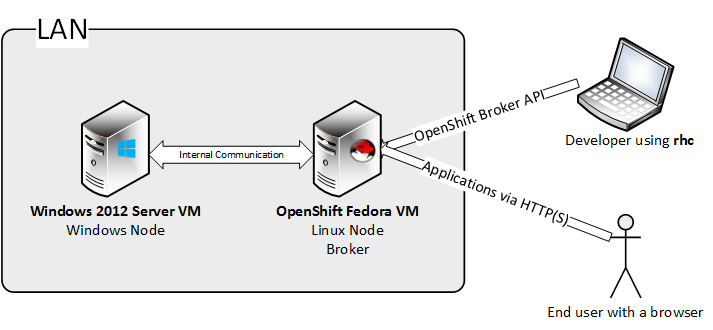
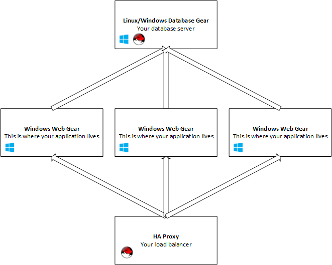

# Deploying OpenShift with Windows support #

This document provides instructions on how to deploy a 2 node OpenShift environment that has Windows support. 
We are going to use an Origin Fedora VM that comes with a full installation - a broker and a node on the same VM.

Next to this we're going to setup a Windows VM that will connect to the Linux OpenShift broker. 

## Cloud Topology ##

## Setting up things on Linux ##

You can download the Linux OpenShift VM from [here](https://mirror.openshift.com/pub/origin-server/release/3/images/). Make sure to download the `openshift-origin.zip` file. For this deployment manual, we support the version from **December 19th 2013**. 

After starting the VM, go to the root console and install the changes required for windows support.

The RPM can be found [here](http://winjenkins.hosts.uhuruos.com/). Credentials are required to download the packages.

To install and update the local machine, run the following commands:

	wget http://<user>:<password>@winjenkins.hosts.uhuruos.com/uhuruorigin-0.<version>.rpm
	yum remove uhuruorigin
	yum install uhuruorigin-0.<version>.rpm
	service mcollective restart
	service openshift-broker restart
	(cd /var/www/openshift/broker/; bundle exec rake tmp:clear)

## Windows Prerequisites ##

The supported Windows versions are Windows Server 2012 and Windows Server 2012 R2.

- After installing Windows, activate the following features:
	- NET-Framework-Features
	- NET-Framework-Core
	- NET-Framework-45-Features
	- NET-Framework-45-Core
	- NET-Framework-45-ASPNET
	- NET-WCF-Services45
	- NET-WCF-TCP-PortSharing45

- Change policy settings to allow users to create symlinks
	- Start the Microsoft Management Console (`mmc.exe`)
	- Go to `File -> Add/Remove Snap-In`
	- Add the `Group Policy Object Editor` for the local computer
	- Go to `Local Computer Policy -> Computer Configuration -> Windows Settings -> Security Settings -> Local policies -> User Rights Assignment`
	- Find the `Create symbolic links` policy, double click it
	- Add the group `Local account` to the list

- Install Internet Information Services
	- Add the Web Server role to Windows, with the following features enabled:

		Web-Server, Web-WebServer, Web-Common-Http, Web-Default-Doc, Web-Dir-Browsing, Web-Http-Errors, Web-Static-Content, Web-Http-Redirect, Web-DAV-Publishing, Web-Health, Web-Http-Logging, Web-Custom-Logging, Web-Log-Libraries, Web-ODBC-Logging, Web-Request-Monitor, Web-Http-Tracing, Web-Performance, Web-Stat-Compression, Web-Dyn-Compression, Web-Security, Web-Filtering, Web-Basic-Auth, Web-CertProvider, Web-Client-Auth, Web-Digest-Auth, Web-Cert-Auth, Web-IP-Security, Web-Url-Auth, Web-Windows-Auth, Web-App-Dev, Web-Net-Ext, Web-Net-Ext45, Web-AppInit, Web-Asp-Net, Web-Asp-Net45, Web-CGI, Web-ISAPI-Ext, Web-ISAPI-Filter, Web-Includes, Web-WebSockets, Web-Mgmt-Tools, Web-Scripting-Tools, Web-Mgmt-Service, Web-WHC

- Install SQL Server 2008
	- Install SQL Server with a simple default instance (no extra services, just the database engine)
    - Make sure you set it up with mixed authentication
    - Please note the password you set for the `sa` account - you will need to configure the OpenShift node with it
    - After the installation is complete, stop the `SQL Server (MSSQLSERVER)` Windows Service, then disable it (the Windows Node installation script will check to see if this was setup correctly)

## Setting up hosts ##

Before proceeding with the Windows installation, you have to setup the hosts files on both Windows and Linux (the OpenShift VM uses multicast DNS and Windows does not have a proper solution for this).

- on Linux, edit `/etc/hosts`, add an entry like 

	e.g.: `10.2.0.104 winnode.openshift.local`

- on Windows, edit `c:\windows\system32\drivers\etc\hosts`, and add an entry for the broker:

	e.g.: `10.2.0.21 broker-a211bd.openshift.local`

## Installing the OpenShift Windows Node ##

Download the windows installer from [here](http://winjenkins.hosts.uhuruos.com/). Credentials are required.

- Run the installer
- It will unpack the build in a temporary folder and drop you in PowerShell
- From there you can run the installation script
- You can simply run ./install.ps1 and the script will ask you for needed information
- If you need special settings, please read the manual below and run the script with the appropriate settings 

### Install Script Manual ###

**SYNTAX**

    E:\Code\openshift.net\output\powershell\Tools\openshift.net\install.ps1 [[-binLocation] <String>] [[-publicHostname] <String>] [[-brokerHost] <String>]
    [[-cloudDomain] <String>] [[-sqlServerSAPassword] <String>] [[-externalEthDevice] <String>] [[-internalEthDevice] <String>] [[-publicIp] <String>]
    [[-gearBaseDir] <String>] [[-gearShell] <String>] [[-gearGecos] <String>] [[-cartridgeBasePath] <String>] [[-platformLogFile] <String>]
    [[-platformLogLevel] <String>] [[-containerizationPlugin] <String>] [[-rubyDownloadLocation] <String>] [[-rubyInstallLocation] <String>]
    [[-mcollectiveActivemqServer] <String>] [[-mcollectiveActivemqPort] <Int32>] [[-mcollectiveActivemqUser] <String>] [[-mcollectiveActivemqPassword]
    <String>] [[-sshdCygwinDir] <String>] [[-sshdListenAddress] <String>] [[-sshdPort] <Int32>] [-skipRuby] [-skipCygwin] [-skipMCollective] [-skipChecks]
    [-skipGlobalEnv] [-skipServicesSetup] [-skipBinDirCleanup] [<CommonParameters>]

**DESCRIPTION**

    This script installs all the components of the OpenShift Windows Node.
    It does not install prerequisites such as Internet Information Services or Microsoft Sql Server.
    Before the installation is started this script will verify that all prerequisites are present and properly installed.

**PARAMETERS**

    -binLocation <String>
        Target bin directory. This is where all the OpenShift binaries will be copied.
        Required?                    no
        Default value                c:\openshift\bin\

    -publicHostname <String>
        Public hostname of the machine. This should resolve to the public IP of this node.
        Required?                    yes

    -brokerHost <String>
        Hostname of the OpenShift broker.
        Required?                    yes

    -cloudDomain <String>
        The domain of the cloud (e.g. mycloud.com).
        Required?                    yes

    -sqlServerSAPassword <String>
        The password for the sa account for the installed instance of SQL Server.
        Required?                    yes

    -externalEthDevice <String>
        Public ethernet device.
        Required?                    no
        Default value                Ethernet

    -internalEthDevice <String>
        Internal ethernet device.
        Required?                    no
        Default value                Ethernet

    -publicIp <String>
        Public IP of the machine (default is 'the first IP on the public ethernet card').
        Required?                    no
        Default value                First IP of the public Ethernet card

    -gearBaseDir <String>
        Gear base directory. This is the where application files will live.
        Required?                    no
        Default value                c:\openshift\gears\

    -gearShell <String>
        Gear shell. This is the shell that will be run when users ssh to the gear.
        Required?                    no

    -gearGecos <String>
        Gecos information. This will be the same for all gears.
        Required?                    no

    -cartridgeBasePath <String>
        Cartridge base path. This is where cartridge files will be copied.
        Required?                    no
        Default value                c:\openshift\cartridges\

    -platformLogFile <String>
        Log file path. This is where the OpenShift Windows Node will log information.
        Required?                    no
        Default value                c:\openshift\log\platform.log

    -platformLogLevel <String>
        Log level. The level of detail to use when logging information.
        Required?                    no
        Default value                DEBUG

    -containerizationPlugin <String>
        Container used for securing OpenShift gears on Windows.
        Required?                    no
        Default value                uhuru-prison

    -rubyDownloadLocation <String>
        Ruby 1.9.3 msi package download location. The installer will download this msi and install it.
        Required?                    no
        Default value                http://dl.bintray.com/oneclick/rubyinstaller/rubyinstaller-1.9.3-p448.exe?direct

    -rubyInstallLocation <String>
        Ruby installation location. This is where ruby will be installed on the local machine.
        Required?                    no
        Default value                c:\openshift\ruby\

    -mcollectiveActivemqServer <String>
        ActiveMQ Host. This is where the ActiveMQ messaging service is installed. It is usually setup in the same place as your broker.
        Required?                    no
        Default value                Broker Host

    -mcollectiveActivemqPort <Int32>
        ActiveMQ Port. The port to use when connecting to ActiveMQ.
        Required?                    no
        Default value                61613

    -mcollectiveActivemqUser <String>
        ActiveMQ Username. The default ActiveMQ username for an OpenShift installation is 'mcollective'.
        Required?                    no
        Default value                mcollective

    -mcollectiveActivemqPassword <String>
        ActiveMQ Password. The default ActiveMQ password for an ActiveMQ installation is 'marionette'.
        Required?                    no
        Default value                marionette

    -sshdCygwinDir <String>
        Location of sshd installation. This is where cygwin will be installed.
        Required?                    no
        Default value                c:\openshift\cygwin

    -sshdListenAddress <String>
        This specifies on which interface should the SSHD service listen. By default it will listen on all interfaces.
        Required?                    no
        Default value                0.0.0.0

    -sshdPort <Int32>
        SSHD listening port.
        Required?                    no
        Default value                22

    -skipRuby [<SwitchParameter>]
        This is a switch parameter that allows the user to skip downloading and installing Ruby.
        This is useful for testing, when the caller is sure Ruby is already installed in the directory specified by the -rubyInstallLocation parameter.
        Required?                    no

    -skipCygwin [<SwitchParameter>]
        This is a switch parameter that allows the user to skip downloading and installing Cygwin.
        This is useful for testing, when the caller is sure Cygwin is present in the directory specified by the -sshdCygwinDir parameter.
        Note that sshd will NOT be re-configured if you skip this step.
        Required?                    no

    -skipMCollective [<SwitchParameter>]
        This is a switch parameter that allows the user to skip downloading and installing MCollective.
        This is useful for testing, when the caller is sure MCollective is already present in c:\openshift\mcollective.
        Configuration of MCollective will still happen, even if this parameter is present.
        Required?                    no

    -skipChecks [<SwitchParameter>]
        This is a switch parameter that allows the user to skip checking for prerequisites.
        This should only be used for debugging/development purposes.
        Required?                    no

    -skipGlobalEnv [<SwitchParameter>]
        This is a switch parameter that allows the user to skip setting up global environment variables and aliases.
        This is useful for testing, when the user wants to manually set these variables.
        Required?                    no

    -skipServicesSetup [<SwitchParameter>]
        This is a switch parameter that allows the user to skip setting up Windows Services for MCollective and SSHD.
        This is useful in development environments, when it's not necessary to restart services (e.g. the developer only wants to update the .NET binaries)
        Required?                    no

    -skipBinDirCleanup [<SwitchParameter>]
        This is a switch parameter that allows the user to skip cleaning up the binary directory.
        This is useful in development environments, when presistence of logs and configurations is required.
        Required?                    no

    -verbose
		This switch enables verbose output

NOTES

    -------------------------- EXAMPLE 1 --------------------------

    C:\PS>.\install.ps1 -publicHostname winnode-001.mycloud.com -brokerHost broker.mycloud.com -cloudDomain mycloud.com

    Install the node by passing the minimum information required.

    -------------------------- EXAMPLE 2 --------------------------

    C:\PS>.\install.ps1 -publicHostname winnode-001.mycloud.com -brokerHost broker.mycloud.com -cloudDomain mycloud.com -publicIP 10.2.0.104

    Install the node by also passing the public IP address of the machine.

## Creating your first Windows application ##

From a client machine, use rhc to connect to your OpenShift cloud.

All OpenShift applications that contain a Windows cartridge must be configured as scalable.
When you use `rhc` to create a Windows application, make sure to specify the `-s` flag.

Example:

	rhc create-app myapp dotnet -s
	
Add a MS SQL Server cartridge

	rhc add-cartridge mssql -a myapp

A Windows application deployed on OpenShift has the following topology:

